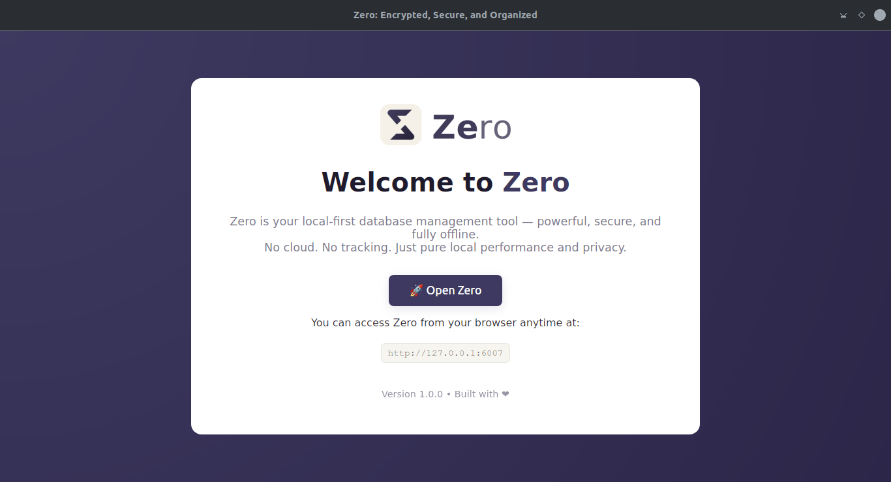
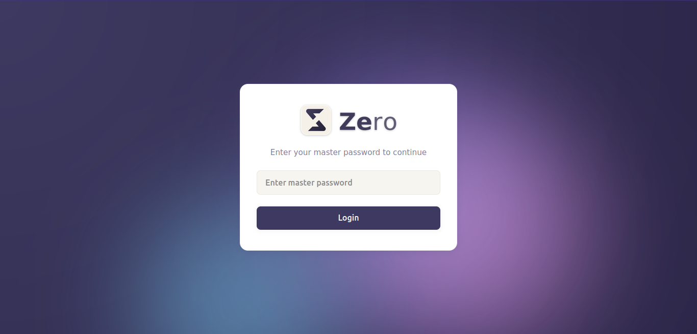
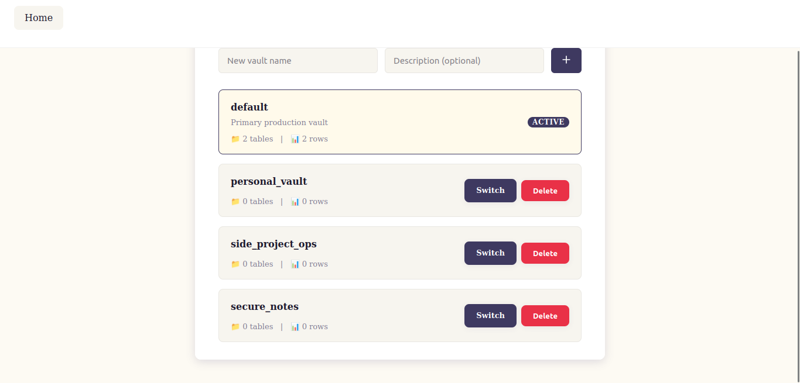
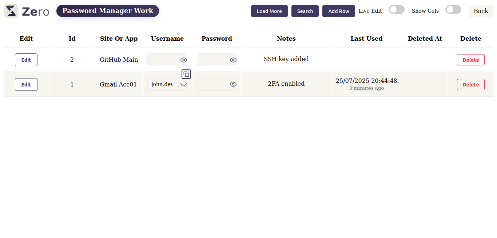

# Zero — Encrypted Vault App (Local-First, Private, Yours)

**Zero** is a fully local, encrypted vault app for storing private, structured data — built for founders, devs, and anyone who values control over their information.

No accounts. No cloud. No tracking.

---

## 🔒 What Is Zero?

Zero gives you your own encrypted database vaults — perfect for:

- Passwords and login credentials  
- Metadata or structured personal info  
- Private notes, OTPs, backups  
- Journals, research, or code snippets  
- Local-first, zero-trust storage

> Everything stays on your machine. You decrypt only when you want to.

---

## 🌐 App & Docs

- 🔗 **Landing Page** → [techdobz.com/apps/zero](https://techdobz.com/apps/zero)  
- 📘 **Documentation** → [techdobz.com/docs](https://techdobz.com/docs)  
- ☕ **Ko-fi / Support** → [ko-fi.com/techdobz](https://ko-fi.com/techdobz)

---

## 📩 Feature Requests & Bug Reports

This repo is the public issue tracker for **Zero**.

🛠️ Open an issue if you want to:

- Request a feature  
- Suggest a template or use case  
- Report a bug or UX issue  
- Ask for support or ideas

👉 [Create an issue](https://github.com/techdobz/zero-app/issues)

---

## 📸 Preview

---

## 💡 What Can You Do with Zero?

- Build your own encrypted password manager  
- Organize private notes, tokens, recovery info  
- Track metadata for files, receipts, or offline logs  
- Store research, articles, or code with field structure  
- Create templates for reusable vault setups

Everything is searchable, structured, and stored locally — with encryption baked in.

---

## 🤝 Support the Project

If Zero helps you, consider supporting it on Ko-fi:

☕ [ko-fi.com/techdobz](https://ko-fi.com/techdobz)

Or share it with someone who values privacy and productivity.

---

## 🔐 Zero-Trust by Design

- 🔒 Local vaults (.db) are encrypted at rest  
- 🔑 Your master password decrypts vaults only on demand  
- 🧠 No telemetry, no accounts, no internet dependency

> **Your data. Your machine. Your rules.**

---

## 🛠 Built By

[**Techdobz**](https://techdobz.com) — systems, tools, and automation for founders and teams.

---
